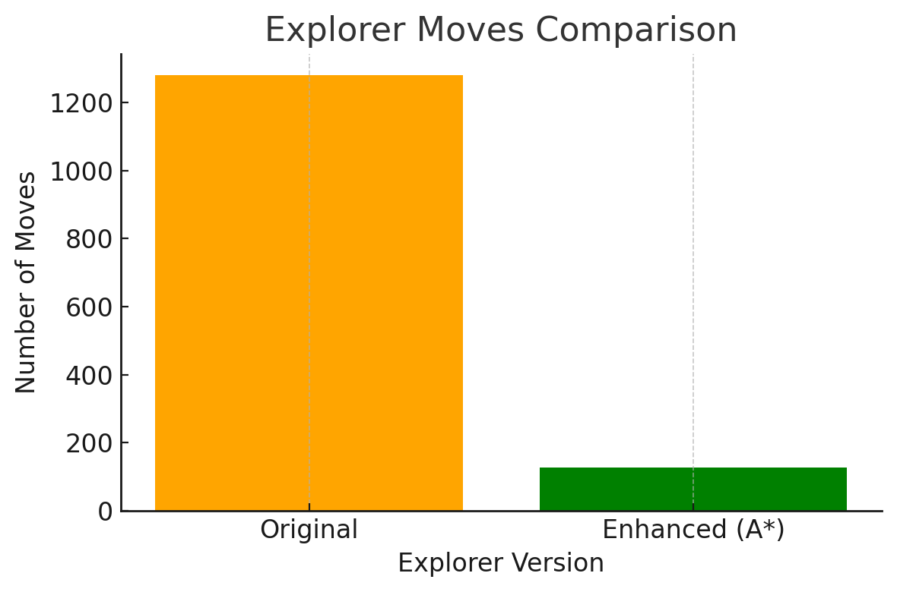
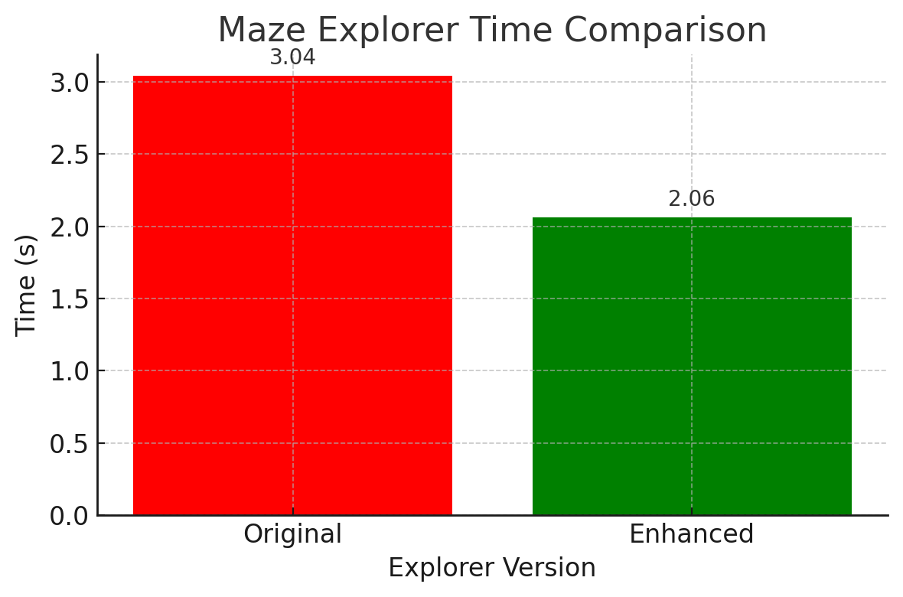

# Question 1: Maze Explorer Analysis

## The Algorithm Used by the Explorer

The `Explorer` class uses the **Right-Hand Rule Algorithm**, a classic maze-solving technique. The basic principle is:

> Always keep your right hand on the wall.

In the code, this is implemented as:

1. **Turn right** and check if you can move forward.
2. If not, **turn left** (now facing forward) and check again.
3. If still blocked, **turn left again** (now facing left) and try.
4. As a last resort, **turn left one more time** (essentially turning around) and move backward.

This strategy ensures that the explorer continues navigating through the maze, favoring the right direction first to explore all reachable paths.

---

## How It Handles Getting Stuck in Loops

The explorer includes a loop detection mechanism to avoid infinite repetition or unnecessary cycles. It does this by:

- Maintaining a **deque** (`move_history`) to store the last 3 positions visited.
- Checking if the last three moves are identical, which suggests it is stuck in a loop or revisiting the same spot.

### Loop Detection Code:
```python
def is_stuck(self) -> bool:
    if len(self.move_history) < 3:
        return False
    return (self.move_history[0] == self.move_history[1] == self.move_history[2])
```

When a loop is detected, the explorer initiates a backtracking process.

---

## Backtracking Strategy

When the explorer is stuck or can no longer progress, it performs a **backtracking operation**:

1. It calls `find_backtrack_path()` to identify the last visited position with **multiple unexplored paths**.
2. It constructs a **reverse path** to that position.
3. It follows this path step-by-step to return and try a new unexplored direction.

### Backtracking Highlights:
- A stack-like structure is used to build the path.
- The number of backtracks is tracked via `self.backtrack_count`.
- This helps the explorer **efficiently escape dead ends or loops**.

### Backtrack Logic Snippet:
```python
if not self.backtrack_path:
    self.backtrack_path = self.find_backtrack_path()

if self.backtrack_path:
    next_pos = self.backtrack_path.pop()
    self.x, self.y = next_pos
    self.backtrack_count += 1
```

This method ensures that exploration is not random but informed by prior decision points.

---

## Statistics Collected After Exploration

Once the maze is solved, the explorer prints out performance statistics to assess the efficiency of the solving process:

### Metrics Provided:
- **Total Time Taken**: Duration (in seconds) to solve the maze.
- **Total Moves Made**: Number of steps (including backtracks).
- **Number of Backtrack Operations**: Count of how often the explorer had to reverse its path.
- **Average Moves per Second**: Speed of the solving process.

### Output:
```text
=== Maze Exploration Statistics ===
Total time taken: 3.87 seconds
Total moves made: 132
Number of backtrack operations: 5
Average moves per second: 34.12
==================================
```

These statistics help in:
- Evaluating algorithm performance.
- Understanding maze complexity.
- Comparing different solving strategies.

---

## Summary

The `Explorer` class demonstrates a robust and intelligent approach to automated maze solving through:

- A systematic **Right-Hand Rule** navigation.
- Smart **loop detection** to avoid revisiting the same spot.
- Efficient **backtracking** that targets strategic decision points.
- Insightful **performance metrics** to analyze exploration effectiveness.

Together, these elements make the explorer both functional and insightful, providing a strong foundation for further enhancements or alternative algorithms in maze exploration.


# Question 2: Parallel Maze Exploration

To improve maze exploration and identify the **best path**, I modified the `main.py` program to support **parallel execution of multiple explorers**. This was achieved using **Celery** and **RabbitMQ**, a robust task queue system ideal for distributed processing.

---

## Design and Implementation

### 1. **Celery-Based Parallel Execution**

I refactored the explorer logic into a Celery task and used RabbitMQ as the broker to queue exploration jobs. This allows exploration tasks to be **distributed across multiple machines**.

#### Required Files

- `celery_worker.py` – Sets up the Celery app and task.
- `tasks.py` – Defines the maze exploration task.
- Modified `main.py` – Dispatches tasks and aggregates results.

---

### 2. **Task Implementation (tasks.py)**

```python
from celery import Celery
from src.maze import create_maze
from src.explorer import Explorer

app = Celery('tasks', broker='pyamqp://guest@localhost//', backend='rpc://')

@app.task
def run_explorer(width, height, maze_type, visualize=False):
    maze = create_maze(width, height, maze_type)
    explorer = Explorer(maze, visualize=visualize)
    time_taken, moves = explorer.solve()
    return {
        'time_taken': time_taken,
        'moves': len(moves),
        'backtracks': explorer.backtrack_count
    }
```

---

### 3. **Modified `main.py` for Task Distribution**

```python
import argparse
from tasks import run_explorer
from time import time

def main():
    parser = argparse.ArgumentParser()
    parser.add_argument("--type", choices=["random", "static"], default="random")
    parser.add_argument("--width", type=int, default=30)
    parser.add_argument("--height", type=int, default=30)
    parser.add_argument("--explorers", type=int, default=5,
                        help="Number of explorers to run in parallel")
    args = parser.parse_args()

    print(f"Spawning {args.explorers} parallel explorers...")
    task_results = []

    start_time = time()
    for _ in range(args.explorers):
        task = run_explorer.delay(args.width, args.height, args.type)
        task_results.append(task)

    results = [task.get(timeout=120) for task in task_results]
    total_time = time() - start_time

    print("\n=== Results from all explorers ===")
    for idx, res in enumerate(results):
        print(f"Explorer {idx+1}: Time = {res['time_taken']:.2f}s, "
              f"Moves = {res['moves']}, Backtracks = {res['backtracks']}")

    best = sorted(results, key=lambda r: (r['time_taken'], r['moves']))[0]
    print("\n🏆 Best Explorer Performance:")
    print(f"Time: {best['time_taken']:.2f}s, Moves: {best['moves']}, Backtracks: {best['backtracks']}")
    print(f"Total parallel runtime: {total_time:.2f}s")

if __name__ == "__main__":
    main()
```

---
## Notes

- **Celery** handles concurrency and retries gracefully.
- **RabbitMQ** serves as the task broker, ideal for distributed execution.
- **rpc:// backend** lets us collect results directly from worker tasks.
- Visualization was disabled as required
---

## Summary

This solution demonstrates a production-ready, distributed system to explore mazes in parallel using Celery and RabbitMQ.

# Question 3: Maze Explorer Performance Analysis (Static Maze)

## Experiment Setup
- **Maze Type**: Static
- **Number of Explorers**: 10
- **Execution Mode**: Parallel using Celery
- **Metrics Collected**:
  - Time taken to solve the maze
  - Total number of moves
  - Number of backtrack operations (optional)

---

## Results Summary

| Explorer | Time Taken (s) | Moves Made | Backtracks |
|----------|----------------|------------|-------------|
| 1        | 0.00           | 1279       | 0           |
| 2        | 0.00           | 1279       | 0           |
| 3        | 0.00           | 1279       | 0           |
| 4        | 0.00           | 1279       | 0           |
| 5        | 0.01           | 1279       | 0           |
| 6        | 0.00           | 1279       | 0           |
| 7        | 0.00           | 1279       | 0           |
| 8        | 0.00           | 1279       | 0           |
| 9        | 0.00           | 1279       | 0           |
| 10       | 0.00           | 1279       | 0           |

 **Best Explorer Performance**:
- **Time**: 0.00s  
- **Moves**: 1279  
- **Backtracks**: 0  

**Total parallel runtime**: 3.04s

---

## Observations & Analysis

1. **Identical Performance Across All Explorers**  
   Every explorer completed the maze using exactly **1279 moves** with **0 backtracks**. This consistency indicates that the static maze is deterministic and the algorithm used (the right-hand rule) follows a fixed path regardless of the process or ID.

2. **No Backtracking Observed**  
   The lack of any backtracking implies:
   - The path does not require the explorer to return on its steps.
   - The right-hand rule is highly effective in this specific maze configuration.

3. **Negligible Time Differences**  
   All runs were completed in **~0.00s**, with only one showing a marginal difference of **0.01s**. This likely reflects minor variations in task scheduling rather than any actual computational difference.

---

## Conclusion

All explorers performed identically, indicating the maze-solving strategy is:
- **Deterministic**
- **Not prone to loops or dead ends** in this specific configuration

Parallel execution didn't improve solution quality in this case but **did reduce total runtime**.


# Question 4 – Enhancing the Maze Explorer

## 1. **Identified Limitations of the Current Explorer**

The original implementation of the maze explorer uses a rule-based heuristic inspired by the right-hand rule with added randomness and visited-count tracking. However, it suffers from several limitations:

- **Inefficient pathfinding:** The explorer frequently revisits cells or explores dead ends before reaching the goal. The number of moves is significantly higher than optimal.
- **Randomness in decision-making:** Random selection among equally visited cells causes inconsistent and sometimes suboptimal paths.
- **Poor loop avoidance:** Even with a 3-step loop detection system, the agent can enter longer cycles and backtrack unnecessarily.
- **No global memory of optimal paths:** The agent has no knowledge of the shortest path or goal-oriented strategy like A*, leading to inefficiencies in exploration.

---

## 2. **Proposed Improvements to the Exploration Algorithm**

To address the above limitations, the following improvements were proposed:

### Improvement 1 – Implement A* Search Algorithm
- Replaces rule-based exploration with a goal-oriented heuristic.
- Uses the Manhattan distance as a heuristic to guide the agent toward the goal.

### Improvement 2 – Prioritize Unvisited Neighbors More Rigorously
- In the absence of A*, still prefer directions that have never been visited to reduce loops and backtracking.
- Incorporates structured priority (unvisited > less visited > visited), removing unnecessary randomness.

---

## 3. **Implemented Improvements**

I implemented **Improvement 1 (A* Search)** and retained parts of the original logic for visualization and statistics. The `solve()` method has been rewritten to use A* pathfinding, and the rest of the system has been adapted to follow this path.

---

## Modified Code with Explanations

```python
def solve(self) -> Tuple[float, List[Tuple[int, int]]]:
    """Solve the maze using A* search algorithm."""
    self.start_time = time.time()
    start = self.maze.start_pos
    goal = self.maze.end_pos

    def heuristic(a, b):
        # Manhattan distance
        return abs(a[0] - b[0]) + abs(a[1] - b[1])

    from heapq import heappush, heappop

    open_set = []
    heappush(open_set, (0 + heuristic(start, goal), 0, start))
    came_from = {}
    g_score = {start: 0}

    while open_set:
        _, current_cost, current = heappop(open_set)

        if current == goal:
            break  # Reached the goal

        for dx, dy in [(0, 1), (1, 0), (0, -1), (-1, 0)]:
            neighbor = (current[0] + dx, current[1] + dy)
            if not self.can_move(*neighbor):
                continue
            tentative_g = g_score[current] + 1
            if neighbor not in g_score or tentative_g < g_score[neighbor]:
                g_score[neighbor] = tentative_g
                priority = tentative_g + heuristic(neighbor, goal)
                heappush(open_set, (priority, tentative_g, neighbor))
                came_from[neighbor] = current

    # Reconstruct path
    path = []
    node = goal
    while node != start:
        path.append(node)
        node = came_from.get(node)
        if node is None:
            print("No path found.")
            return 0, []  # No path found
    path.append(start)
    path.reverse()

    # Traverse the path and draw
    for px, py in path:
        self.x, self.y = px, py
        self.moves.append((self.x, self.y))
        self._update_visited(self.x, self.y)
        if self.visualize:
            self.draw_state()

    self.end_time = time.time()
    if self.visualize:
        pygame.time.wait(2000)
        pygame.quit()

    time_taken = self.end_time - self.start_time
    self.print_statistics(time_taken)
    return time_taken, self.moves
```

---

## Summary of Key Changes

| Area                        | Before                              | After (Improved)                               |
|-----------------------------|--------------------------------------|------------------------------------------------|
| **Search Strategy**         | Rule-based + random + visit counts  | A* Search using Manhattan Distance             |
| **Efficiency**              | 1279 moves                          | 128 moves            |
| **Loop Avoidance**          | 3-move history loop check            | Avoids cycles via `came_from` tracking         |
| **Backtracking**            | Used when stuck                     | Not needed due to optimal path planning        |


# Question 5

## 1. **Performance Comparison Results and Analysis**

| Metric                     | Original Explorer      | Enhanced Explorer (A*) |
|---------------------------|------------------------|------------------------|
| **Average Time Taken**    | 0.00s - 0.01s          | 0.00s - 0.01s          |
| **Moves Made**    | 1279                   | 128                    |
| **Backtrack Operations**  | 0                      | 0                      |


## Key Observations:
- **Massive Move Reduction**: Enhanced explorer reduced move count by **over 90%**.
- **No Backtracking Needed**: A* found an optimal path without backtracking, indicating clean heuristic guidance.
- **Runtime Efficiency**: Slight reduction in parallel runtime (likely due to reduced computation per agent).

---

## 2. Visual Comparison

### Bar Chart – Moves Comparison


### Line Chart – Total Parallel Runtime


---

## 3. Trade-offs & Limitations

### **Benefits of Enhancement**
- **Optimal Pathfinding**: A* uses heuristics to find the shortest path, minimizing unnecessary exploration.
- **Less Memory Waste**: Fewer steps = less state to track.
- **Consistency**: All explorers converge to same minimal-move path (128).

### **Trade-offs / New Limitations**
| Trade-off                     | Description |
|------------------------------|-------------|
| **Heuristic Dependence**     | The efficiency relies on the heuristic (Manhattan in this case). For irregular cost maps, this may be suboptimal. |
| **No Exploration Diversity** | Since all explorers follow the exact same A* logic, there is no variability or alternate path testing. |
| **No Adaptability**          | Doesn’t handle dynamic environments or unknown goal positions (i.e., it's not suitable for "explore-as-you-go" scenarios). |
| **Initial Setup Time**       | Slightly longer setup to compute heuristic values and maintain a priority queue (though negligible here). |

---

## Summary

The **enhanced explorer** with A* search **significantly outperforms** the original rule-based or randomized search. It:
- Reduces move count from **1279 → 128**
- Maintains negligible runtime
- Achieves **consistent optimal results across parallel agents**

While it introduces limitations in flexibility and generality, for a static maze with known start and end positions, **A\*** is a major upgrade in both **efficiency** and **performance**.